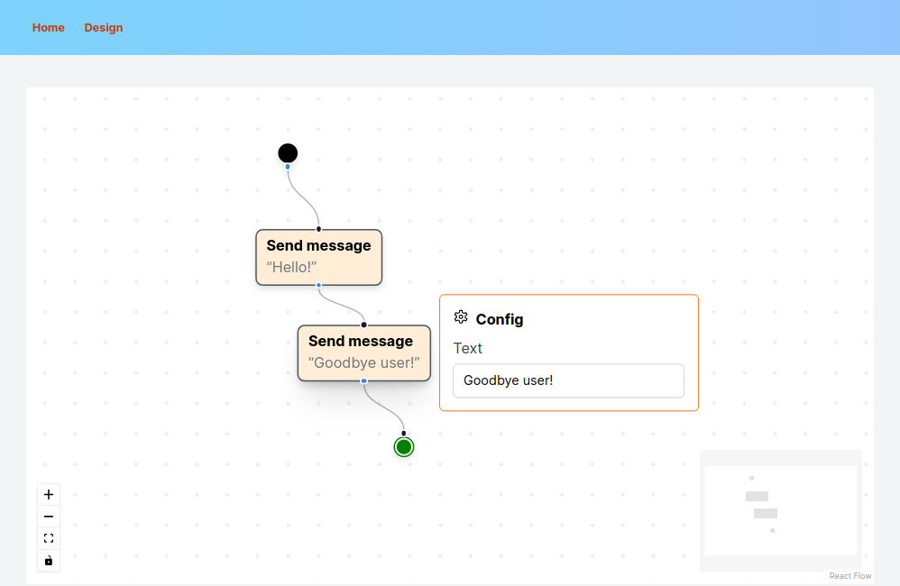

# OpenChatflow

An application to visually design, test, run and monitor Telegram chatbots.

Explore the demo here:

[](https://openchatflow.vercel.app/)

## Features

- Visual designer for Telegram conversations, inspired by [UML 2.x Activity Diagrams](https://en.wikipedia.org/wiki/Activity_diagram)
  

- Nodes that drive the conversation forward:
  - A simple text node that just sends a message to the user
  - A prompt node that asks the user for a response and then continues
  - An option node that prompts the user to make a choice
  - A confirmation node that requires the user to confirm a choice
- Nodes that take actions without disturbing the conversation state
  - HTTP requests
  - (TODO) Logging arbitrary events in the conversation's history
  - (TODO) Setting values in the conversation's memory, to be retrieved later
- (TODO) A conversation context (per conversation) where nodes can store information for later decisions
- (TODO) Branching conversational paths, depending on the user's responses or external systems
  - Could be used to implement arbitrary authorization policies, so that only certain users can use the bot's tools
- Configurable exit statuses for conversations
- (TODO) Testing utilities to test and debug conversations
  - Context viewer and editor
  - Starting conversations from arbitrary points with an arbitrary past history
- (TODO) Conversation monitor for ongoing user conversations

## Development

Run the development server:

```bash
yarn dev
```

Then, open [http://localhost:3000](http://localhost:3000) in your browser.

## Contributing

All contributions are welcome! Code, documentation, UI styling overhauls, bug reports and everything else.

All activity currently takes place in this repository.
